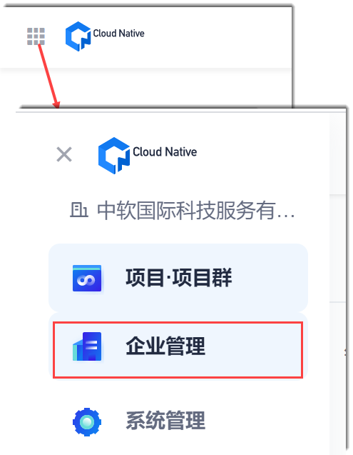
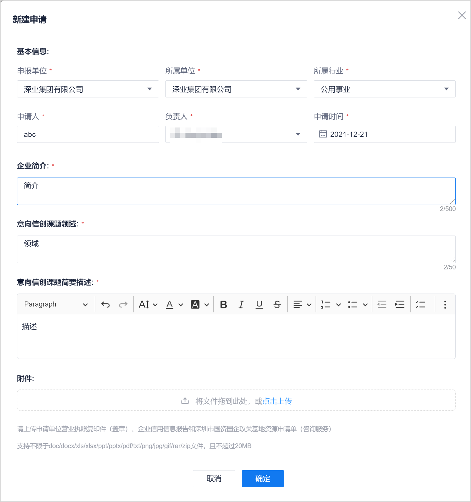

# 新建意向申请

在新建意向申请时，可以有以下两种新建场景：
* **申请单位申请人直接新建**            
  攻关基地运营管理人员给申请单位申请人开通账号并赋予相应的权限。申请单位申请人自行创建意向申请。      
* **攻关基地运营管理人员代申请单位新建**         
  攻关基地运营管理人员收集申请单位的信创项目需求和资质后，代申请单位创建意向申请。

### 前提条件
* 已使用企业非只读人员账号登录系统。 

### 操作步骤
1. 在系统任意页面中，单击左上角的“ > 意向申请管理”。        
                  
2. 在“意向申请管理”页面中，单击右上角的“新建申请”。        
3. 在“新建申请”页面中，根据下表的描述，填写参数，单击“确定”。          
             
  
  

|参数名称|参数说明|
|:------------- |:-------- |
|申报单位|申报信创课题的单位，即信创课题的归属单位。支持手动输入或从下拉列表中选择。最多可输入30个字符。下拉列表取值来源于系统预置。| 
|所属单位|“申报单位”的所属单位。对于有上级单位的申报单位，“所属单位”为“申报单位”的上级单位。支持手动输入或从下拉列表中选择。最多可输入30个字符。下拉列表取值来源于系统预置。|
|所属行业|信创课题所属的行业。|
|申请人|申报单位中，对接此课题的接口人。最多可输入10个字符。| 
|负责人|攻关基地中的项目负责人。下拉列表取值来源于企业成员。| 
|申请时间|课题的申请时间。| 
|企业简介|“申报单位”的简介。最多可输入500个字符。| 
|意向信创课题领域|信创课题的所属领域，即意向申请的标题。最多可输入50个字符。 “申报单位”+“意向信创课题领域”不能重复。|
|意向信创课题简要描述|对信创课题的简要描述。|
|附件|与信创课题相关的材料。例如：申请单位营业执照复印件（盖章）、企业信用信息报告和深圳市国资国企攻关基地资源申请单（咨询服务）。支持doc/docx/xls/xlsx/ppt/pptx/pdf/txt/png/jpg/gif/rar/zip格式的文件，且不超过20Mbit。| 

意向申请新建成功后，系统返回意向申请管理页面，显示刚刚新建的意向申请。其中：
* **意向编号**：由系统自动生成。编号规则为：Y+意向申请创建日期+3位流水号。
* **意向课题**：为申请单中的“意向信创课题领域”字段。                      

