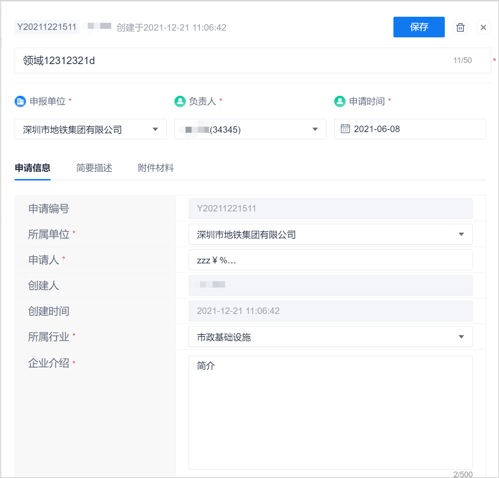

# 修改/删除意向申请

意向申请创建完成后，您也可以修改申请的信息。当意向申请被废弃后，您也可以删除申请，保持系统数据的整洁。

### 前提条件
* 已使用超级管理员或管理员角色，或者意向申请的创建人或负责人账号登录系统。

### 修改意向申请
1. 在“意向申请管理”页面中，单击意向申请后面的，或者单击意向课题名称，然后在意向申请详情页面右上角单击。
2. 在右侧弹出的修改页面中，修改意向申请的相关信息，在右上角单击“保存”。                 
         

### 删除意向申请
1. 在“意向申请管理”页面中，单击意向申请后面的，或者在意向申请修改页面右上角单击，或者单击意向课题名称，然后在意向申请详情页面右上角单击。
2. 在弹出的确认对话框中，单击“删除”。