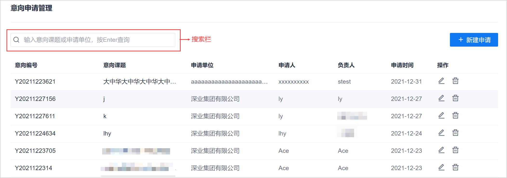
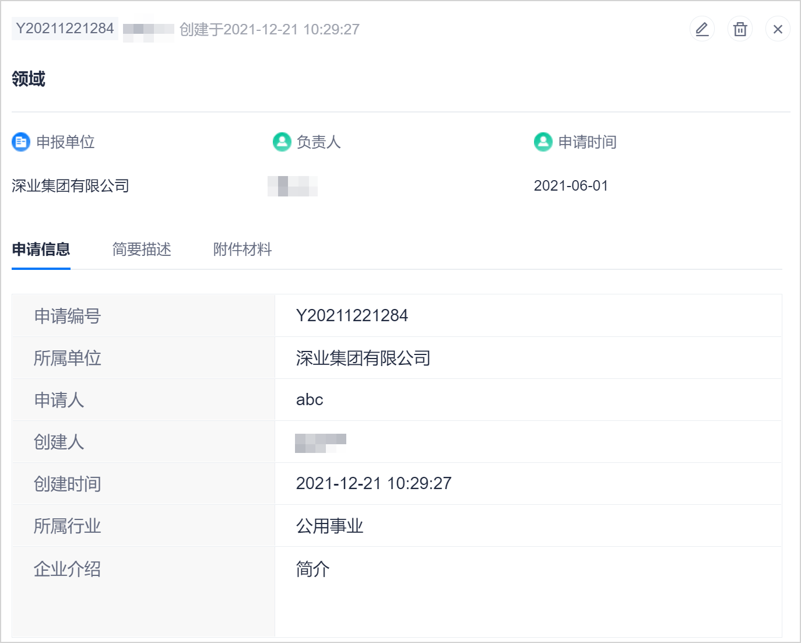

# 查看意向申请

超级管理员和管理员角色可以查看所有意向申请。意向申请的创建人可以查看自己创建的意向申请。意向申请的负责人可以查看自己负责的意向申请。

### 前提条件
* 已使用企业用户的账号登录系统。

### 操作步骤
1. 在意向申请列表页面中，可以查看意向申请条目。您也可以通过列表上方的搜索栏，搜索需要的意向申请。      
                      
3. 单击“意向课题”名称，可查看意向申请的详细信息。
                
  
