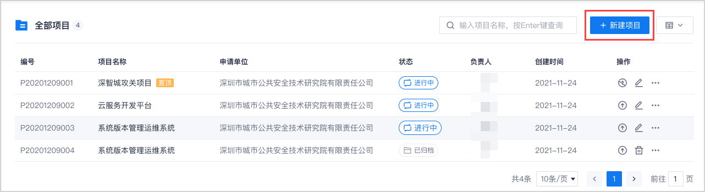
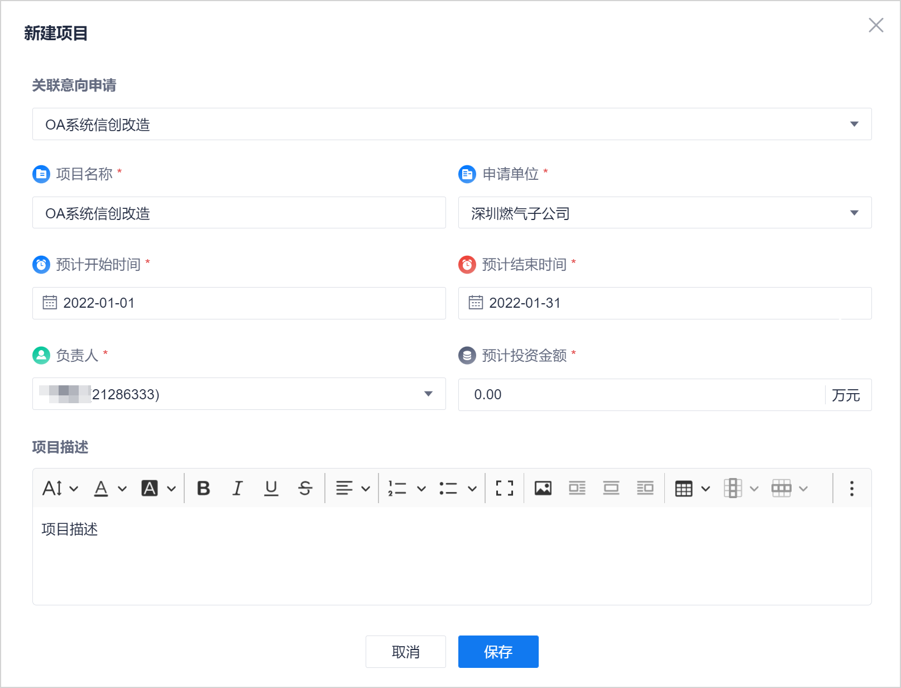

# 新建项目

预可研小组收到企业的意向申请后，需新建项目，用于统一管控项目的全生命周期。

### 前提条件
* 已使用具有企业“攻关项目管理 > 创建项目”权限的账号登录系统。
* 项目相关的意向申请已创建完成。

### 操作步骤
1. 在系统任意页面中，单击左上角的“ > 项目管理”。            
                   
2. 在项目总览页面中，单击右上角的“新建项目”。          
                
3. 在“新建项目”对话框中，填写相关信息，单击“保存”。         
                

   

  <table>
<tr>
    <th>参数名称</th>
    <th>参数说明</th>
</tr>
<tr>
    <td>关联意向申请 </td>
    <td>从下拉菜单中，选择意向申请。选择意向申请后，系统会将意向申请中的内容映射到项目信息中：<ul><li>意向申请中的“意向信创课题领域”：项目中的“项目名称”。</li>
    <li>意向申请中的“申报单位”：项目中的“申请单位”。</li>
    <li>意向申请中的“负责人”：项目中的“负责人”。</li>
   </ul> 映射赋值后，您也可以再修改项目的以上信息。</td>
</tr>
<tr>
    <td>项目名称</td>
    <td>自定义项目的名称，最多支持50个字符。</td>
</tr>
<tr>
    <td>申请单位</td>
    <td>从下拉菜单中选择，或者直接输入项目的申请单位。输入时不能超过30个字符。</td>
</tr>
<tr>
    <td>预计开始时间</td>
    <td>项目的预计开始时间。</td>
</tr>
<tr>
    <td>预计结束时间</td>
    <td>项目的预计结束时间。</td>
</tr>
<tr>
    <td>负责人</td>
    <td>攻关基地中项目的负责人。取值来源于企业用户。</td>
</tr>
<tr>
    <td>预计投资金额</td>
    <td>项目的预计投资金额。可精确到小数点后2位。小数点前最多5位，小数点后最多2位。</td>
</tr>
<tr>
    <td>项目描述</td>
    <td>对项目的描述信息。</td>
</tr>
</table>

项目新建成功后，系统返回项目总览页面，显示刚刚新建的项目，状态为“进行中”。其中，项目编号由系统自动生成。生成规则为：P+意向申请创建日期+3位流水号。

