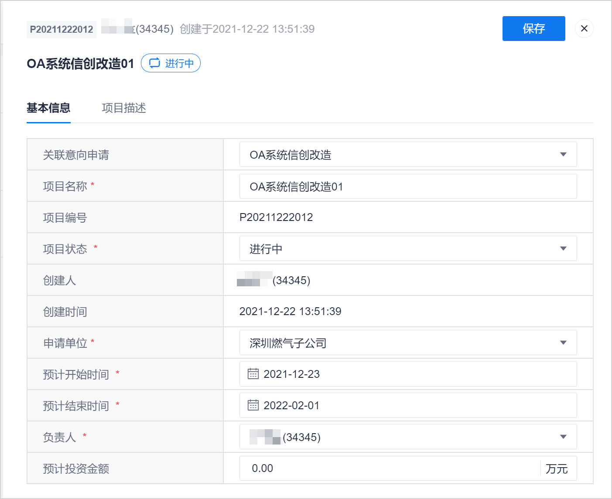

# 修改/删除项目

项目创建完成后，您也可以修改项目的信息。当项目被废弃后，您也可以删除项目，保持系统数据的整洁。

### 前提条件
* 已使用项目负责人账号登录系统。

### 修改项目信息
1. 在项目总览页面中，单击项目后面的。
2. 在项目编辑页面中，修改信息，单击右上角的“保存”。                   
  如果需要修改负责人，则负责人必须为项目成员，且原项目负责人默认改为项目“管理员”角色。
            

### 删除项目
1. 在项目总览页面中，单击项目后面的“ > ”。      
2. 在删除确认对话框中，输入删除原因，单击“删除”。

