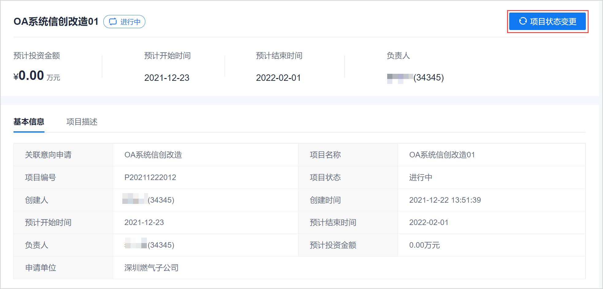

# 变更项目的状态

项目在创建成功后进入“进行中”状态。项目结束后，项目的状态应修改为“已关闭”状态。如果项目设置为“已关闭”状态后，发现还有其它的工作，您也可以将项目状态修改为“进行中”状态。您可以根据实际情况变更项目的状态。          
项目处于“已关闭”状态时，不能发起资源申请，其它功能正常使用。     

### 前提条件
* 已使用项目负责人账号登录系统。

### 操作步骤
1. 在项目总览页面中，单击项目名称，进入项目详情页面。        
2. 单击右上角的“项目状态变更”。                         
         
3. 在“项目状态变更”页面中，选择变更后的状态，输入变更原因，单击“确定”。                
         

系统返回项目详情页面，显示项目状态为修改后的状态。