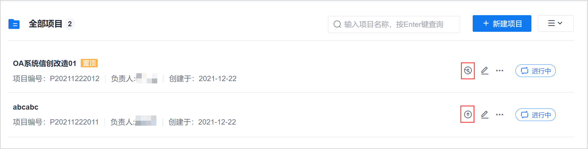

# 置顶/取消置顶项目

您可以将关注的项目置顶。当不再关注置顶的项目时，也可以取消置顶。项目置顶后，项目固定放在最前面，且项目名称后面有“置顶”标记。            
置顶多个项目时，项目按照置顶操作的先后顺序倒序排列，即后置顶的项目排在前面。           
置顶操作只对个人项目列表视图有效，不影响其它成员的项目列表排序。      

### 前提条件
* 已使用项目成员账号登录系统。

### 操作步骤
1. 在项目总览页面中，单击项目操作列的或，可以置顶项目或者取消项目置顶。       
     
