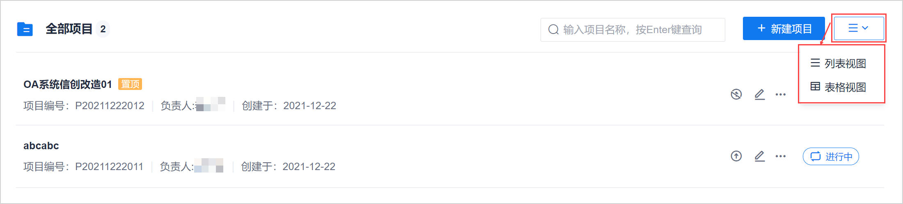
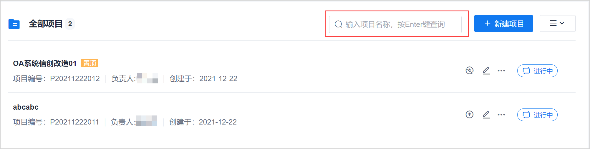
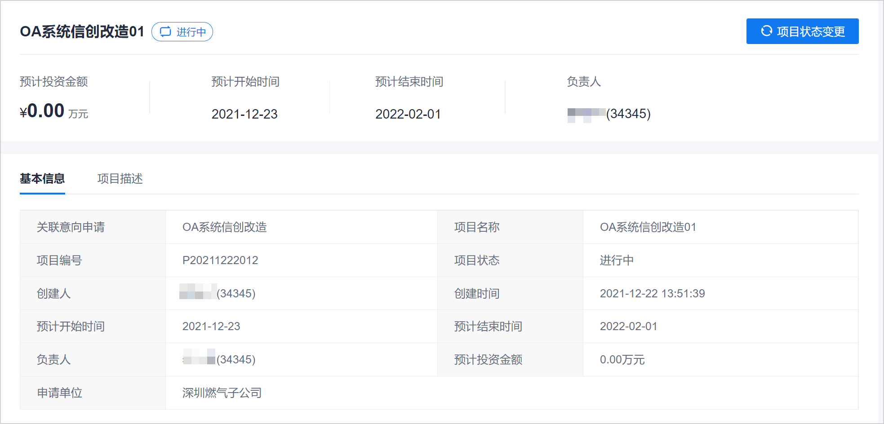

# 查看项目

您可以通过不同的视图查看项目，也可以搜索项目，便于快速找到需要的项目。您也可以查看项目的详细信息。

### 前提条件
* 已使用具有项目“XXXX”权限的账号登录系统。

### 通过不同的视图查看项目                 
在项目总览页面中，单击右上角的视图切换按钮，然后选择“列表视图”或“表格视图”，可以切换项目显示视图。当前页面显示的视图名称为实际使用的视图名称。               
      

### 搜索项目           
在项目总览页面中，在搜索框中输入项目名称的关键字，按下**Enter**键，可查看对应的项目。        
        

### 查看项目详情         
在项目总览页面中，单击项目名称，进入“项目概况 > 基本信息”页面。您可以查看项目的详细信息。          
        
 

