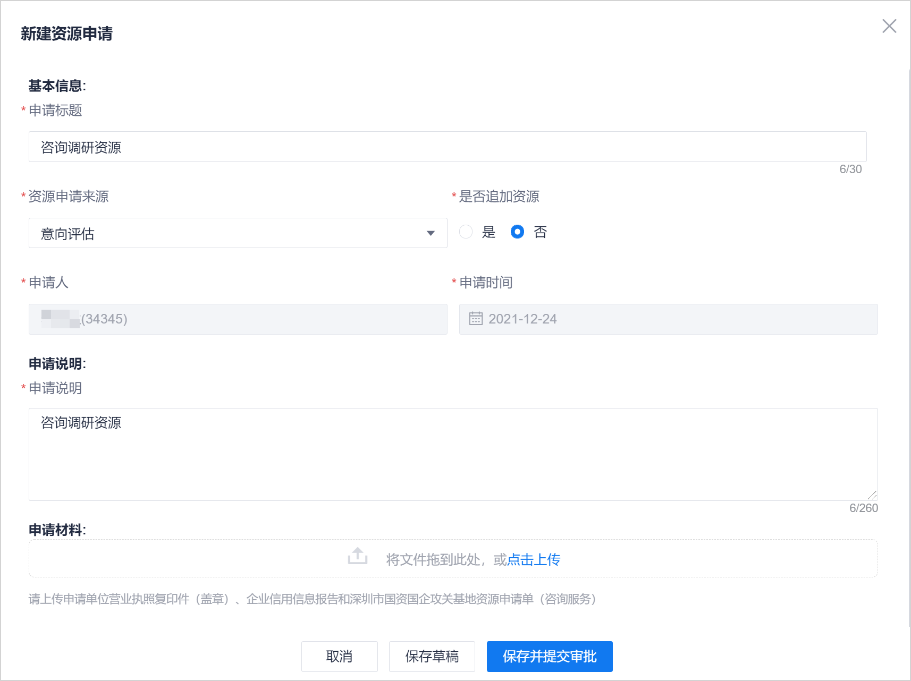

# 新建资源申请

攻关基地项目小组有资源需求时，需要新建资源申请，审批通过后通过规范途径购买资源。

### 前提条件
* 已使用具有项目“xxxxx”权限的账号登录系统。      

### 操作步骤
1. 在项目顶部菜单栏中，单击“项目概况”。
2. 在项目概况左侧导航栏中，单击“资源管理”。         
  右侧页面显示资源申请列表。           
                
3. 在页面右上方，单击“新建资源申请”。
4. 在“新建资源申请”页面中，根据下表的描述填写参数，单击“保存草稿”或“保存并提交审批”。                         
                       

 

  <table>
<tr>
    <th>参数</th>
    <th>说明</th>
</tr>
<tr>
    <td>申请标题 </td>
    <td>最多支持30个字符。</td>
</tr>
<tr>
    <td>资源申请来源</td>
    <td>选择“意向评估”或“实施方案”。</td>
</tr>
<tr>
    <td>是否追加资源</td>
    <td>表示本次申请是否为同一个来源的第一次申请资源。如果是第一次，选择否；如果不是第一次，选择是。</td>
</tr>
<tr>
    <td>申请人</td>
    <td>申请人固定为申请创建人，不可修改。</td>
</tr>
<tr>
    <td>申请时间</td>
    <td>申请时间固定为创建日期，不可修改。</td>
</tr>
<tr>
    <td>申请说明</td>
    <td>填写资源申请的简要描述，最多支持260个字符。</td>
</tr>
<tr>
    <td>申请材料</td>
    <td>与资源申请相关的材料。例如：申请单位营业执照复印件（盖章）、企业信用信息报告和深圳市国资国企攻关基地资源申请单（咨询服务）。支持doc/docx/xls/xlsx/ppt/pptx/pdf/txt/png/jpg/gif/rar/zip格式的文件，且不超过20Mbit。</td>
</tr>
</table>

如果单击“保存草稿”，则下一步由具有XXX权限的人员[提交资源审批](s3.2-apply-resource-application.md)。资源申请的状态为“草稿”。     
如果单击“保存并提交审批”，则在弹出的“提交审批”对话框中，选择审批人，然后单击“确定”。下一步由审批人[审批资源申请](s3.3-approve-resource-application.md)。资源申请的状态为“审批中”。           

