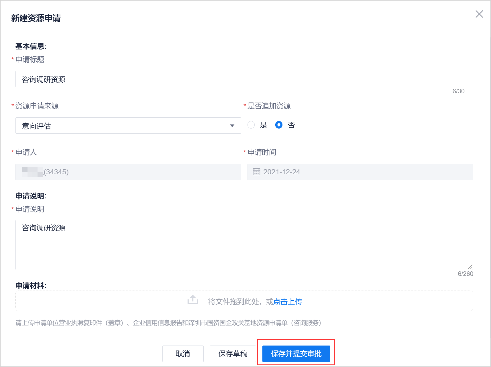
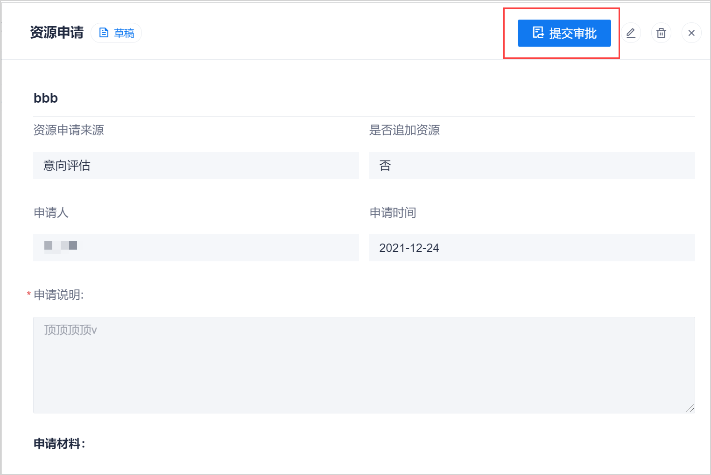
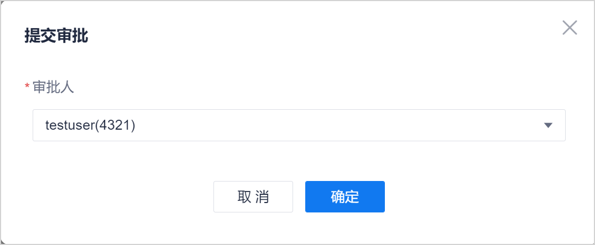

# 提交资源审批

攻关基地项目小组创建资源申请后，需要将资源申请提交给攻关基地运营方审批。

### 前提条件
* 已使用具有项目“XXXXX”权限的账号登录系统。
* 审批人须为企业“审批人”角色的成员。
* 资源申请处于“草稿”或“已退回”状态。

### 操作步骤
1. 在项目顶部菜单栏中，单击“项目概况 > 资源管理”。
2. 采用以下任一方式提交审批：       
  * 在[新建资源申请](s3.1-new-resource-application.md)页面中，单击“保存并提交审批”。       
            
  * 在资源申请列表页面中，单击资源申请名称，进入资源申请详情页面。然后单击右上角的“提交审批”。                    
            
3. 在“提交审批”页面中，选择审批人，单击“确定”。                       
  审批人须为企业“审批人”角色的成员。     
          

提交审批成功后，系统返回资源申请列表页面。资源申请的状态变为“审批中”。系统会给审批人发送消息通知。下一步由审批人[审批资源申请](s3.3-approve-resource-application.md)。 