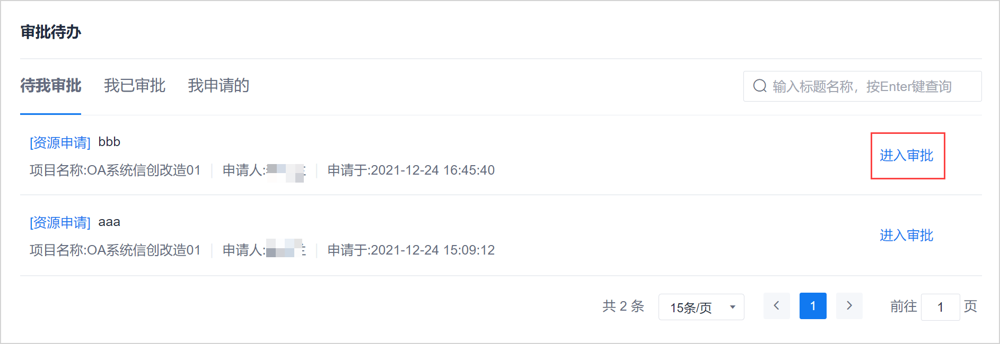
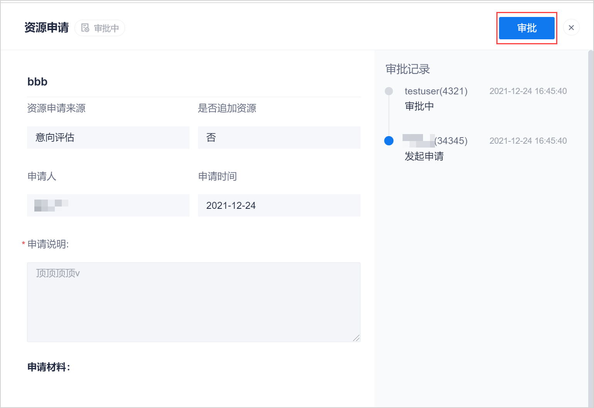
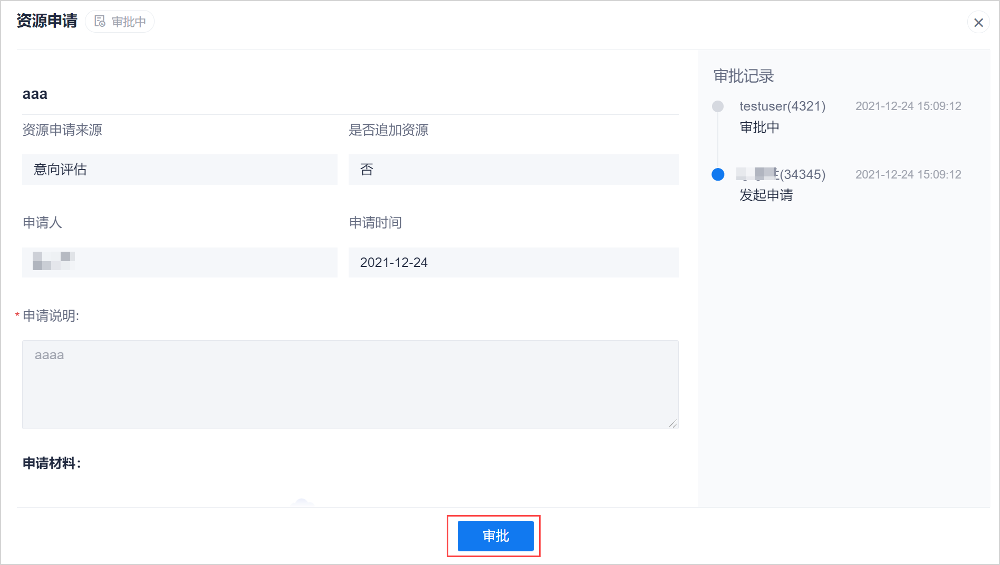
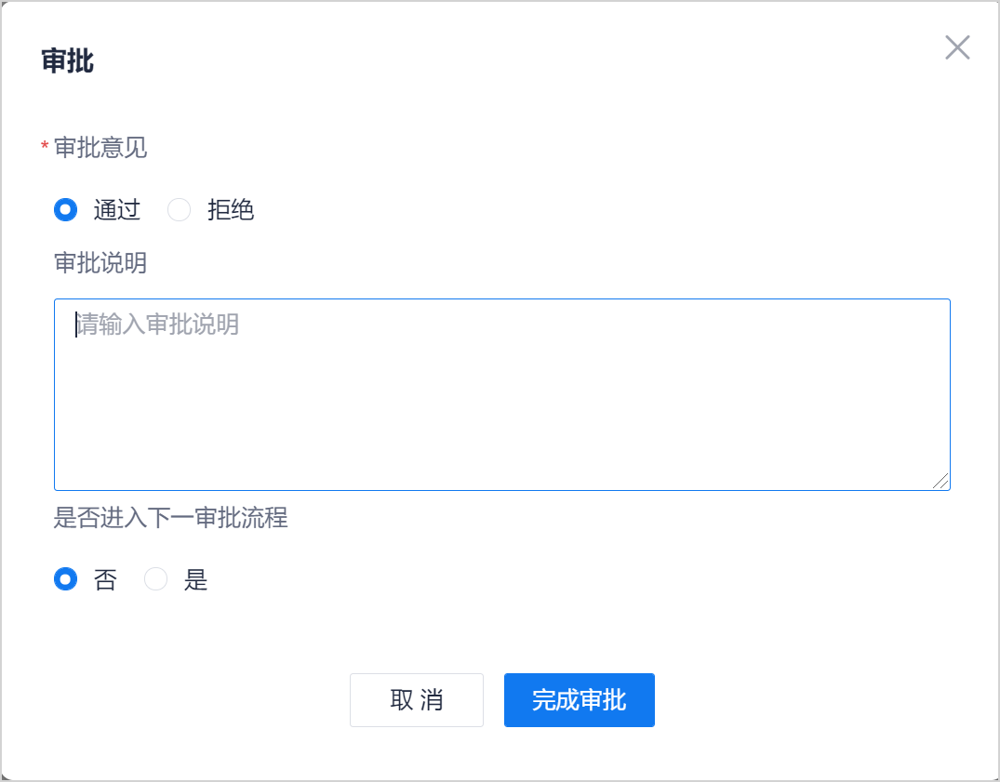

# 审批资源申请

资源申请提交审批后，审批人可通过系统菜单的“审批待办”、资源申请详情（必须为项目成员）和消息通知进入审批通道，进行审批。

### 前提条件
* 已使用审批人账号登录系统。

### 背景信息       
资源申请支持级联审批。当审批通过后，您可以选择是否进入下一审批流程。

### 操作步骤
1. 选择任一方式进入审批通道：
  * **从系统菜单的“审批待办”进入**                 
    1. 在系统任一界面中，在左上角单击“ > 审批待办”。
    2. 在“审批待办”页面中，单击“待我审批”页签。
    3. 单击资源申请项的“进入审批”。           
              
    系统进入资源申请审批页面。
  * （审批人为项目成员时支持）**从资源申请详情进入**                    
    1. 在项目顶部菜单栏中，单击“项目概况 > 资源管理”。
    2. 在资源申请列表中，单击申请标题。                          
    系统进入资源申请详情页面，并在右上角显示“审批”按钮。      
              
  * **从消息通知进入**
    在系统消息中，单击消息进入审批页面；在邮件消息中，单击“点击进行审批”，进入审批页面。

2. 在资源申请审批页面或者资源申请详情页面中，单击“审批”。             
> [!NOTE]
> 不同页面的“审批”按钮位置不同，以下截图以资源申请审批页面为例。

           
3. 在“审批”对话框中，填写审批意见、审批说明，并选择“是否进入下一审批流程”，然后单击“完成审批”。       
  其中，当“审批意见”为通过时，“审批说明”为非必填；当“审批意见”为拒绝时，“审批说明”为必填，需要填写拒绝原因。       
           

如果需要进入下一审批流程，则需要下一审批人再进行审批，以此类推，不再赘述。             
审批通过后，资源申请的状态变为“已通过”；审批拒绝后，资源申请的状态变为“已退回”。             

审批后，系统会发送通知消息（具体发送方式参见[设置的项目审批通知策略](http://amp.gcbdcloud.com/help/chapters/yungui/6.8.1-set-project-approve-note.html)）给申请人。
