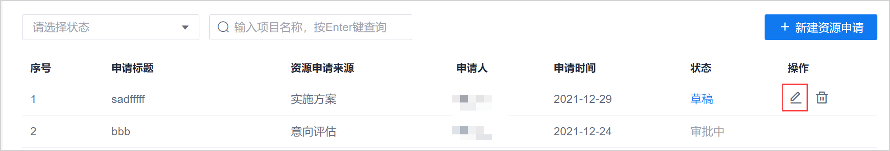
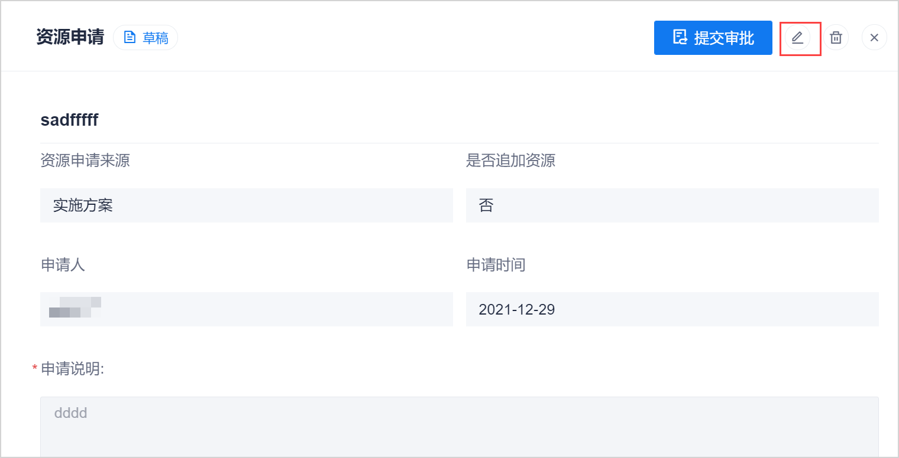

# 修改/删除资源申请

当资源申请处于“草稿”和“已退回”状态时，您可以修改/删除资源申请。当资源申请处于其它状态时，不可被修改/删除。

### 前提条件
* 已使用具有项目“XXXXX”权限的账号登录系统。
* 资源申请处于“草稿”或“已退回”状态。

### 修改资源申请
1. 选择任一方式进入资源申请编辑页面：
  * 在资源申请列表中，单击处于“草稿”或“已退回”状态的资源申请后面的。         
             
  * 在资源申请列表中，单击处于“草稿”或“已退回”状态的申请名称，进入资源申请详情。然后在右上角单击。               
    
2. 修改相关信息，单击“保存”或“保存并提交审批”。

### 删除资源申请                       
资源申请被删除后，状态变为“作废”，并且不会显示在资源申请列表中。     
1. 选择任一方式删除资源申请：
  * 在资源申请列表中，单击处于“草稿”或“已退回”状态的资源申请后面的。         
  * 在资源申请列表中，单击处于“草稿”或“已退回”状态的申请名称，进入资源申请详情。然后在右上角单击。               
2. 在弹出的确认对话框中，单击“删除”。

 

