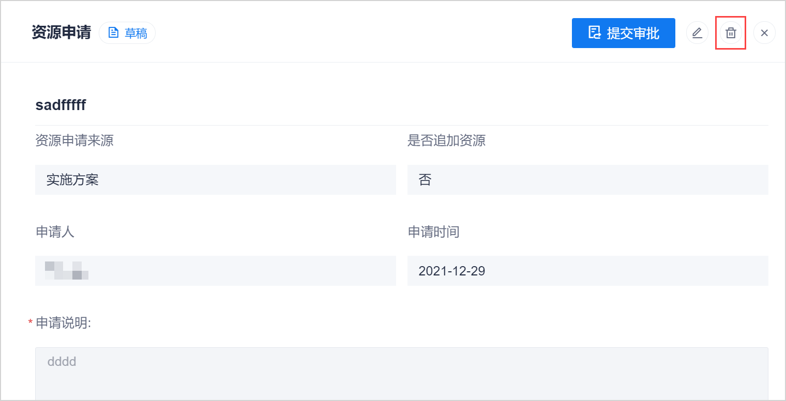

# 删除资源申请

当资源申请处于“草稿”和“已退回”状态时，您可以删除资源申请。当资源申请处于其它状态时，不可被删除。

### 前提条件
* 已使用具有项目“XXXXX”权限的账号登录系统。
* 资源申请处于“草稿”或“已退回”状态。

### 操作步骤
1. 选择任一方式删除资源申请：
  * 在资源申请列表中，单击处于“草稿”或“已退回”状态的资源申请后面的。         
             
  * 在资源申请列表中，单击处于“草稿”或“已退回”状态的申请名称，进入资源申请详情。然后在右上角单击。               
         
2. 在弹出的确认对话框中，单击“删除”。