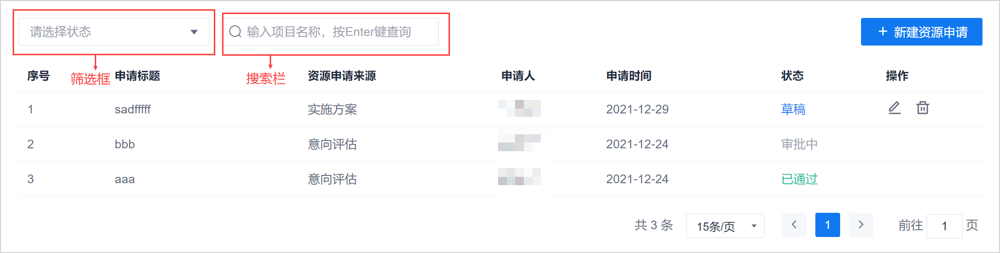
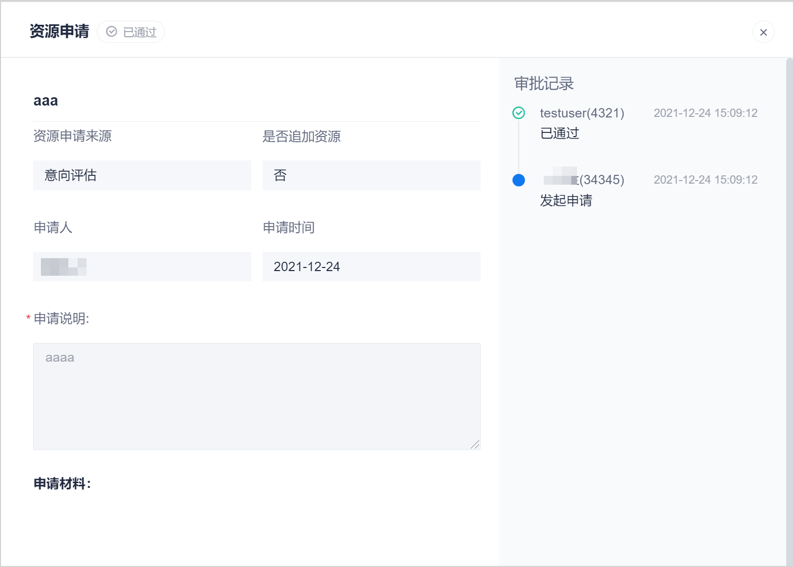

# 查看资源申请

企业超级管理员角色和项目成员默认可以查看所有资源申请。

### 前提条件
* 已使用企业超级管理员账号、或者项目成员账号登录系统。

### 操作步骤
1. 在资源申请列表页面中，可以查看所有的资源申请条目。您也可以通过列表上方的筛选框和搜索栏，筛选或者搜索需要的资源申请。      
                      
2. 单击申请标题，可查看资源申请的详细信息，以及审批情况。       
                
  
