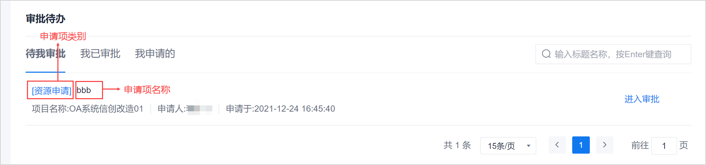

# 审批待办

为了方便审批人快速进行审批，系统提供个人审批待办功能，审批人无需进入项目，也无需加入项目即可完成审批。

审批待办支持快速查看待我审批的、我已审批的、我申请的申请项。      

通过审批待办进入项目时，需要加入项目。      

### 操作入口         
在系统任意页面中，单击“ > 审批待办”，进入审批待办页面。     

### 页面说明               
审批待办的页面如下图所示。
                       
您可以单击对应的页签，查看相应的内容。您也可以单击申请项名称，查看申请项的信息（需加入项目，并具备相应的权限）。

### 审批申请      
1. 在审批待办页面中，单击“待我审批”页签。
2. 单击申请项后面的“进入审批”。
3. 进行相关申请项的审批。

### 查看申请信息       
查看申请信息是进入项目中的相关页面查看，因此，需具备项目的对应权限。       
1. 在审批待办页面中，在“待我审批”、“我已审批”、“我申请的”任意页签中，单击申请项名称，可以查看申请的详细信息。